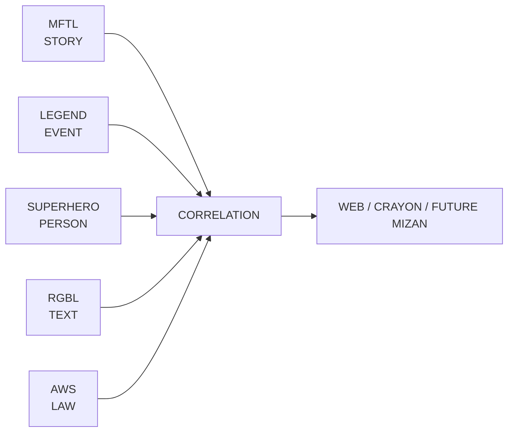

<div align="center">


# ROCKSOUL CORRELATION

## **THE PUBLIC EVIDENCE GRAPH**

### **CONNECT THE TRAILS. KEEP THE UNCERTAINTY.**

A public, provenance-first correlation layer for connecting **STORY × EVENT × PERSON × TEXT × LAW** without collapsing those domains into one verdict.


[Architecture](docs/ARCHITECTURE.md) · [Schema](schemas/correlation-edge.schema.json) · [Golden case](data/cases/jerusalem-70.json) · [Validation](#validation)

</div>

---

> **Correlation explains how records relate. It does not own the records, and it does not decide ultimate truth.**

A similarity is not causation.  
A temporal match is not identity.  
A textual parallel is not fulfillment.  
A witness is not infallible.  
A legal relation is not a moral verdict.  
A high-confidence edge is still an explainable claim with provenance.

## Ecosystem role



| Domain | Canonical owner | Correlation responsibility |
|---|---|---|
| STORY | [`rocksoul-mftl`](https://github.com/bjo163/rocksoul-mftl) | reference narrative records |
| EVENT | [`rocksoul-legend`](https://github.com/bjo163/rocksoul-legend) | reference historical-event records |
| PERSON | [`rocksoul-superhero`](https://github.com/bjo163/rocksoul-superhero) | reference actor / transmission records |
| TEXT | [`rocksoul-rgbl`](https://github.com/bjo163/rocksoul-rgbl) | reference exact-text records |
| LAW | [`rocksoul-aws`](https://github.com/bjo163/rocksoul-aws) | reference legal/applicability records |
| CORRELATION | **`rocksoul-correlation`** | own explainable cross-domain edges only |

## Golden rule

### **CORRELATION ≠ CAUSATION**

Every edge must state **what kind of relationship is claimed, what supports it, what weakens it, and what remains uncertain**.

## Edge model

```text
CORRELATION EDGE
├── id
├── source_ref
│   ├── repository
│   ├── domain
│   └── record_id
├── target_ref
│   ├── repository
│   ├── domain
│   └── record_id
├── relation_type
├── direction
├── support
├── counterevidence
├── alternative_explanations
├── dimensions
│   ├── temporal
│   ├── geographic
│   ├── semantic
│   ├── identity
│   └── provenance
├── confidence
├── epistemic_status
├── sources
└── notes
```

### Initial relation vocabulary

`attests` · `witnessed_by` · `describes` · `corresponds_to` · `temporally_aligns_with` · `geographically_aligns_with` · `textually_parallels` · `legally_relevant_to` · `contradicts` · `supports` · `weakens` · `derived_from` · `transmitted_by` · `alternative_to`

The vocabulary is intentionally bounded. New relation types should be added only when an existing type cannot describe a real case without semantic distortion.

## Correlation dimensions

Correlation is not one opaque number. Each edge may expose independent dimensions:

```text
TEMPORAL      how well timing aligns
GEOGRAPHIC    how well place aligns
SEMANTIC      how closely meanings correspond
IDENTITY      whether records plausibly refer to the same entity
PROVENANCE    how independent / traceable the evidence chain is
```

A combined confidence may be stored for ranking and presentation, but it must never hide the dimension-level evidence.

## Epistemic states

```text
SUPPORTED
PARTIAL
DISPUTED
UNRESOLVED
CONTRADICTED
INDETERMINATE
```

These are **edge states**, not verdicts on people, traditions, religions, cultures, or entire repositories.

## Golden case — Jerusalem 70 CE

The first integration case connects existing domain ownership without duplicating canonical objects:

```text
RGBL TEXT
Mark 13:2
    ↓ corresponds_to
MFTL STORY
Temple-destruction prediction narrative
    ↓ corresponds_to
LEGEND EVENT
Jerusalem / Second Temple destruction, 70 CE
    ↑ witnessed_by
SUPERHERO PERSON
Flavius Josephus
```

AWS may attach a legal relation only when a real legal question exists. **The graph preserves correspondence without converting correspondence into supernatural fulfillment.**

See [`data/cases/jerusalem-70.json`](data/cases/jerusalem-70.json).

## Public transparency contract

This repository is public because its job is to make reasoning inspectable.

Public records should expose:

- canonical foreign references;
- relation semantics;
- provenance;
- supporting evidence;
- counterevidence;
- alternative explanations;
- uncertainty;
- confidence dimensions;
- machine-validation state.

Private research notes, credentials, unpublished submissions, moderation data, and operational workspace state belong in `rocksoul-crayon` / `rocksoul-platform`, not here.

## Design contract

Visual language comes from [`rocksoul-assets`](https://github.com/bjo163/rocksoul-assets). Implementation components should come from [`rocksoul-ui`](https://github.com/bjo163/rocksoul-ui).

Correlation views should use the canonical graph, evidence-matrix, provenance, timeline, and data-viz grammar from `rocksoul-assets/moonwitness/data-viz/` rather than inventing a parallel style.

## Repository atlas

```text
rocksoul-correlation/
├── data/
│   └── cases/                 reviewed cross-domain correlation cases
├── docs/
│   └── ARCHITECTURE.md        ownership, semantics and guardrails
├── schemas/
│   └── correlation-edge.schema.json
├── scripts/
│   └── validate.mjs           structural + semantic validation
├── .github/workflows/
│   └── validate.yml
├── package.json
└── README.md
```

## Validation

```bash
npm install
npm run validate
```

Validation checks:

1. required correlation fields;
2. domain/repository ownership consistency;
3. stable edge identifiers;
4. bounded relation vocabulary;
5. confidence values in `0..1`;
6. no self-referential source/target edge;
7. unique edge IDs;
8. evidence / counterevidence arrays;
9. golden-case domain coverage.

## Boundary with future Mizan

```text
CORRELATION
  describes relationships
  exposes evidence
  exposes uncertainty
        ↓
MIZAN
  may later weigh a reviewed graph
```

`rocksoul-correlation` must remain useful **even if no Mizan engine exists**.

---

<div align="center">


## **THE CONCLUSION MAY BE DISPUTED. THE TRAIL SHOULD BE INSPECTABLE.**

### **CONNECT · SOURCE · CONTRADICT · EXPLAIN**

`CORRELATION / MoonWitness × Rocksoul`

</div>
