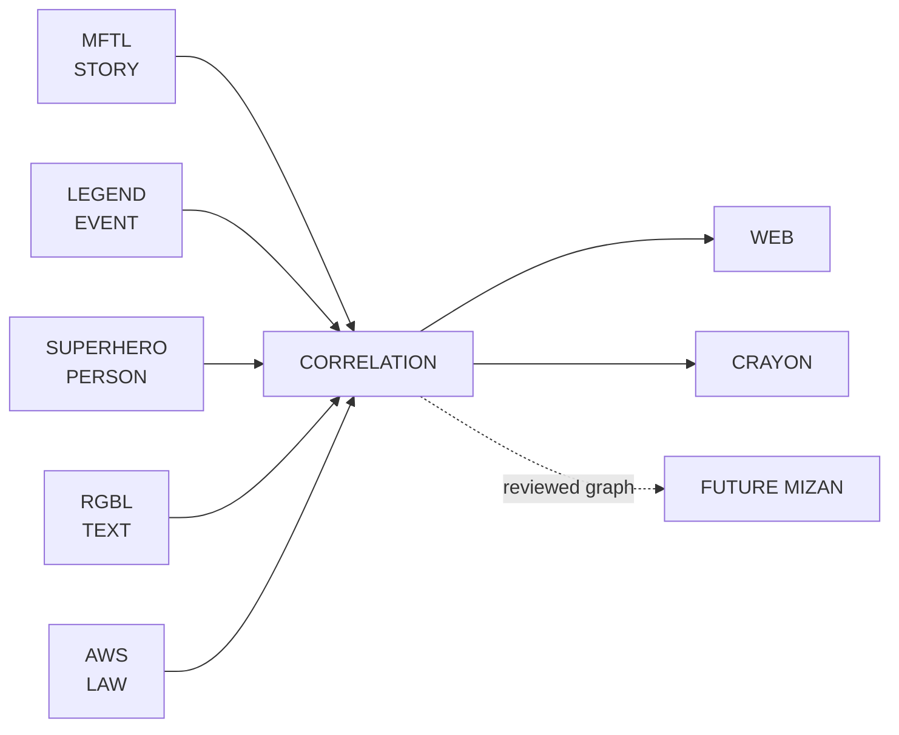

<div align="center">


# ROCKSOUL CORRELATION

## **THE PUBLIC EVIDENCE GRAPH**

### **CONNECT THE TRAILS. KEEP THE UNCERTAINTY.**

A public, provenance-first correlation layer for connecting **STORY × EVENT × PERSON × TEXT × LAW** without collapsing those domains into one verdict.


[Architecture](docs/ARCHITECTURE.md) · [Golden Corpus](docs/GOLDEN-CORPUS.md) · [Schema](schemas/correlation-edge.schema.json) · [Contributing](CONTRIBUTING.md) · [Validation](#validation)

</div>

---

> **Correlation explains how records relate. It does not own the records, and it does not decide ultimate truth.**

A similarity is not causation.  
A temporal match is not identity.  
A textual parallel is not fulfillment.  
A witness is not infallible.  
A legal relation is not a court judgment.  
A high-confidence edge is still an explainable claim with provenance.

## Ecosystem role



| Domain | Canonical owner | Correlation responsibility |
|---|---|---|
| STORY | [`rocksoul-mftl`](https://github.com/bjo163/rocksoul-mftl) | reference narrative records |
| EVENT | [`rocksoul-legend`](https://github.com/bjo163/rocksoul-legend) | reference historical-event records |
| PERSON | [`rocksoul-superhero`](https://github.com/bjo163/rocksoul-superhero) | reference actor / transmission records |
| TEXT | [`rocksoul-rgbl`](https://github.com/bjo163/rocksoul-rgbl) | reference exact-text records |
| LAW | [`rocksoul-aws`](https://github.com/bjo163/rocksoul-aws) | reference legal/applicability records |
| CORRELATION | **`rocksoul-correlation`** | own explainable cross-domain edges only |

## Golden rule

### **CORRELATION ≠ CAUSATION**

Every edge states **what relationship is claimed, what supports it, what weakens it, what alternatives remain, and how certain the relation is**.

## Edge model

```text
CORRELATION EDGE
├── id
├── source_ref
│   ├── repository
│   ├── domain
│   ├── record_id
│   └── resolution      canonical | candidate
├── target_ref
│   └── ...
├── relation_type
├── direction
├── support
├── counterevidence
├── alternative_explanations
├── dimensions
│   ├── temporal
│   ├── geographic
│   ├── semantic
│   ├── identity
│   └── provenance
├── confidence
├── epistemic_status
├── sources
└── notes
```

### Reference resolution

`canonical` means the owning repository has already minted the source record. `candidate` means the real-world relationship is worth modeling but the owning repository has not yet published the stable record. Candidate bindings remain visibly non-canonical until owner-repo promotion.

### Relation vocabulary

`attests` · `witnessed_by` · `describes` · `corresponds_to` · `temporally_aligns_with` · `geographically_aligns_with` · `textually_parallels` · `legally_relevant_to` · `contradicts` · `supports` · `weakens` · `derived_from` · `transmitted_by` · `alternative_to`

New relation types are added only when an existing type would materially distort a real case.

## Correlation dimensions

```text
TEMPORAL      timing alignment
GEOGRAPHIC    place alignment
SEMANTIC      meaning correspondence
IDENTITY      entity-resolution strength
PROVENANCE    traceability / independence of evidence
```

A combined confidence is useful for ranking and presentation, but never replaces the dimension-level trail.

## Epistemic states

```text
SUPPORTED
PARTIAL
DISPUTED
UNRESOLVED
CONTRADICTED
INDETERMINATE
```

These are **edge states**, not verdicts on people, traditions, religions, cultures, institutions, or entire repositories.

## Five-case golden corpus

| Case | Main regression guard |
|---|---|
| **Jerusalem / Second Temple, 70 CE** | correspondence ≠ supernatural fulfillment |
| **Lindow Man** | vivid ritual theory ≠ exclusive explanation |
| **Bath curse tablets** | modern category ≠ single recoverable motive |
| **Oseberg women** | person evidence ≠ invented historical identity |
| **ICC temporal jurisdiction** | legal relevance ≠ jurisdiction/guilt judgment |

Together they exercise **STORY · EVENT · PERSON · TEXT · LAW** and both `canonical` and `candidate` reference semantics.

See [`docs/GOLDEN-CORPUS.md`](docs/GOLDEN-CORPUS.md).

## Public transparency contract

Public correlation records expose:

- source-domain references and resolution state;
- relation semantics;
- provenance;
- support;
- counterevidence;
- alternative explanations;
- uncertainty;
- five confidence dimensions;
- machine-validation state.

Private research notes, credentials, unpublished submissions, moderation data, and operational workspace state belong in `rocksoul-crayon` / `rocksoul-platform`, not here.

## Design contract

Visual language comes from [`rocksoul-assets`](https://github.com/bjo163/rocksoul-assets). Implementation components come from [`rocksoul-ui`](https://github.com/bjo163/rocksoul-ui).

Correlation surfaces should reuse canonical node-link graph, evidence matrix, provenance, timeline, graph-node, edge-style, annotation, and status grammar from `rocksoul-assets/moonwitness/data-viz/`.

## Repository atlas

```text
rocksoul-correlation/
├── data/cases/
│   ├── jerusalem-70.json
│   ├── lindow-man.json
│   ├── bath-curse-tablets.json
│   ├── oseberg-women.json
│   └── icc-temporal-jurisdiction.json
├── docs/
│   ├── ARCHITECTURE.md
│   └── GOLDEN-CORPUS.md
├── schemas/
│   └── correlation-edge.schema.json
├── scripts/
│   └── validate.mjs
├── .github/workflows/
│   └── validate.yml
├── CONTRIBUTING.md
├── package.json
└── README.md
```

## Validation

```bash
npm run validate
```

CI verifies:

1. domain → repository ownership consistency;
2. unique stable case and edge IDs;
3. bounded relation vocabulary;
4. non-self-referential edges;
5. required support and inspectable sources;
6. explicit candidate/canonical semantics;
7. counterevidence/alternatives for guarded epistemic states;
8. five independent dimension values in `0..1`;
9. LAW-edge legal-boundary notes;
10. minimum five-case corpus and full five-domain coverage;
11. canonical Jerusalem foundation regression coverage.

## Candidate → canonical workflow

```text
REAL-WORLD LEAD
      ↓
CANDIDATE EDGE
      ↓
OWNER REPO MINTS RECORD
      ↓
REFERENCE PROMOTION
      ↓
REVALIDATE EVIDENCE + STATUS
      ↓
CANONICAL CORRELATION
```

Correlation never mints another domain's canonical record on its behalf.

## Boundary with future Mizan

```text
CORRELATION
  describes relationships
  exposes evidence
  exposes counterevidence
  preserves alternatives
  exposes uncertainty
        ↓
MIZAN
  may later weigh a reviewed graph
```

`rocksoul-correlation` remains independently useful **even if no Mizan engine exists**.

---

<div align="center">


## **THE CONCLUSION MAY BE DISPUTED. THE TRAIL SHOULD BE INSPECTABLE.**

### **CONNECT · SOURCE · CONTRADICT · EXPLAIN**

`CORRELATION / MoonWitness × Rocksoul`

</div>
