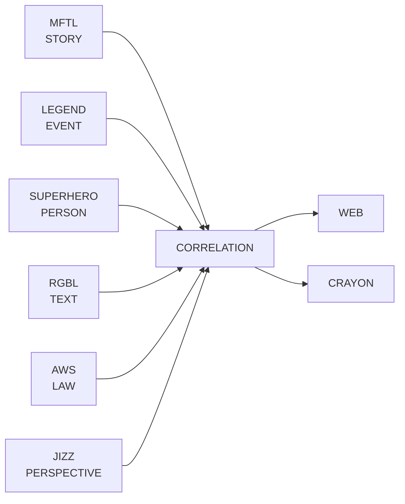

<div align="center">


# ROCKSOUL CORRELATION

## **THE PUBLIC EVIDENCE GRAPH**

### **CONNECT THE TRAILS. KEEP THE UNCERTAINTY.**

A public, provenance-first correlation layer for connecting **STORY × EVENT × PERSON × TEXT × LAW × PERSPECTIVE** without collapsing those domains into one verdict.


[Architecture](docs/ARCHITECTURE.md) · [Ecosystem Contract](docs/ecosystem-contract.json) · [Golden Corpus](docs/GOLDEN-CORPUS.md) · [Schema](schemas/correlation-edge.schema.json) · [Contributing](CONTRIBUTING.md) · [Validation](#validation)

</div>

---

> **Correlation explains how records relate. It does not own the records, and it does not decide ultimate truth.**

A similarity is not causation.  
A temporal match is not identity.  
A textual parallel is not fulfillment.  
A witness is not infallible.  
A legal relation is not a court judgment.  
A perspective is not the event being observed.  
A high-confidence edge is still an explainable claim with provenance.

## Ecosystem role



| Domain | Canonical owner | Correlation responsibility |
|---|---|---|
| STORY | [`rocksoul-mftl`](https://github.com/bjo163/rocksoul-mftl) | reference narrative records |
| EVENT | [`rocksoul-legend`](https://github.com/bjo163/rocksoul-legend) | reference historical-event records |
| PERSON | [`rocksoul-superhero`](https://github.com/bjo163/rocksoul-superhero) | reference actor / transmission records |
| TEXT | [`rocksoul-rgbl`](https://github.com/bjo163/rocksoul-rgbl) | reference exact-text records |
| LAW | [`rocksoul-aws`](https://github.com/bjo163/rocksoul-aws) | reference legal/applicability records |
| PERSPECTIVE | [`rocksoul-jizz`](https://github.com/bjo163/rocksoul-jizz) | reference reviewed perspective records |
| RELATIONSHIP | **`rocksoul-correlation`** | own explainable cross-domain edges only |

## Golden rule

### **CORRELATION ≠ CAUSATION · CORRELATION ≠ JIZZ**

Every edge states **what relationship is claimed, what supports it, what weakens it, what alternatives remain, and how certain the relation is**. A JIZZ perspective may be connected to an EVENT, STORY, or LAW, but the perspective remains owned by JIZZ and the connected record remains owned by its source repository.

## Reference resolution

Qualified references preserve owner identity:

```text
mftl:<story-id>
legend:<event-id>
superhero:<person-id>
rgbl:<text-id>
aws:<law-id>
jizz:<perspective-id>
```

`canonical` means the owning repository has already minted the source record. `candidate` means the real-world relationship is worth modeling but the owning repository has not yet published the stable record. Candidate bindings remain visibly non-canonical until owner-repo promotion.

## Edge model

```text
CORRELATION EDGE
├── id
├── source_ref
│   ├── repository
│   ├── domain
│   ├── record_id
│   └── resolution      canonical | candidate
├── target_ref
│   └── ...
├── relation_type
├── direction
├── support
├── counterevidence
├── alternative_explanations
├── dimensions
│   ├── temporal
│   ├── geographic
│   ├── semantic
│   ├── identity
│   └── provenance
├── confidence
├── epistemic_status
├── sources
└── notes
```

## Validation

```bash
npm run validate
npm test
```

CI verifies:

1. domain → repository ownership consistency, including `PERSPECTIVE → rocksoul-jizz`;
2. unique stable case and edge IDs;
3. bounded relation vocabulary;
4. non-self-referential edges;
5. required support and inspectable sources;
6. explicit candidate/canonical semantics;
7. counterevidence/alternatives for guarded epistemic states;
8. five independent dimension values in `0..1`;
9. LAW-edge legal-boundary notes;
10. minimum five-case corpus and full six-research-domain coverage;
11. canonical Jerusalem foundation regression coverage.

## Candidate → canonical workflow

```text
REAL-WORLD LEAD
      ↓
CANDIDATE EDGE
      ↓
OWNER REPO MINTS RECORD
      ↓
REFERENCE PROMOTION
      ↓
REVALIDATE EVIDENCE + STATUS
      ↓
CANONICAL CORRELATION
```

Correlation never mints another domain's canonical record on its behalf.

## Mizan boundary

`MIZAN` is an analytical methodology/capability, not another canonical world-object domain. Correlation may expose reviewed evidence for downstream analysis, but no correlation edge is a universal Mizan verdict.

---

<div align="center">


## **THE CONCLUSION MAY BE DISPUTED. THE TRAIL SHOULD BE INSPECTABLE.**

### **CONNECT · SOURCE · CONTRADICT · EXPLAIN**

`CORRELATION / MoonWitness × Rocksoul`

</div>
